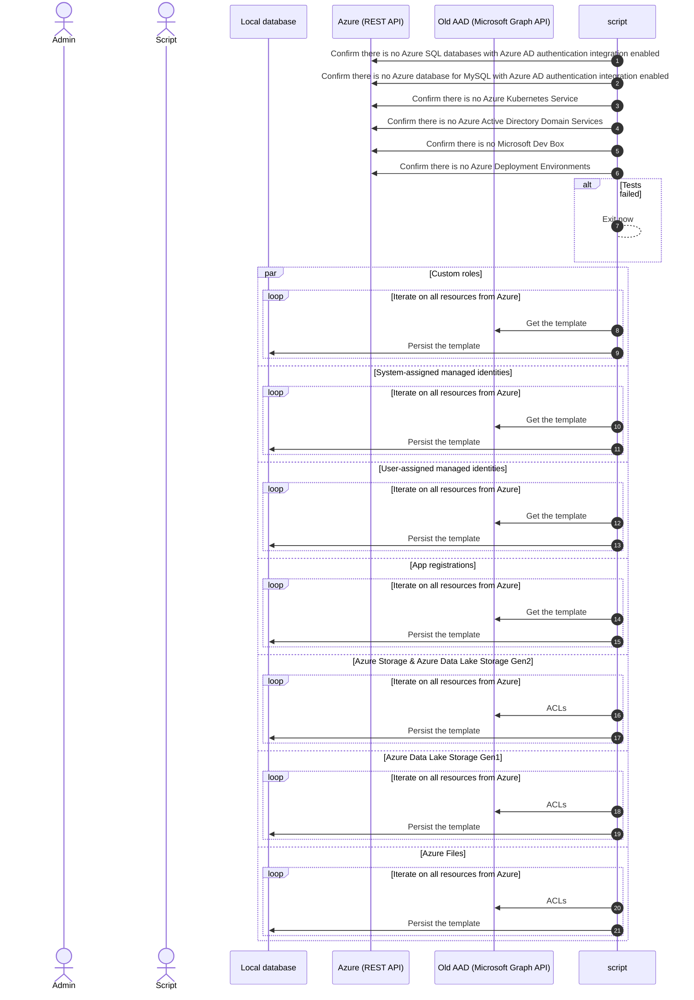
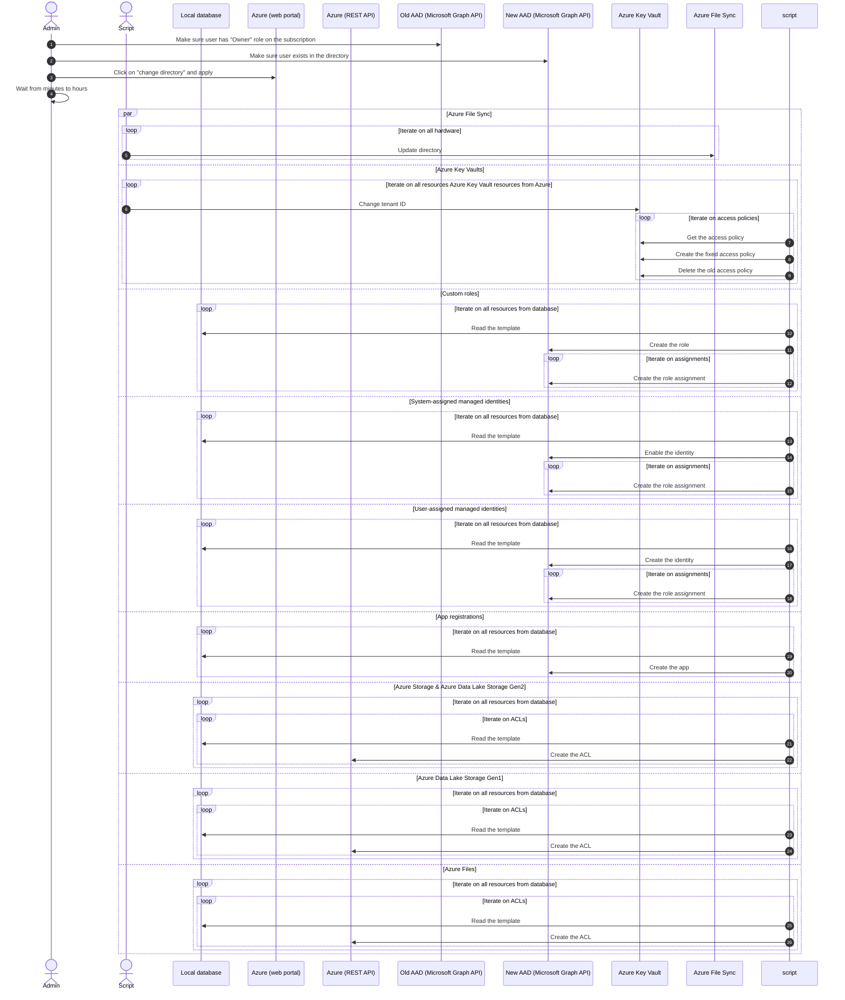

# Transfer subscription from one Active Directory tenant to another

## Documentation

General:

- [Transfer an Azure subscription to a different Azure AD directory](https://learn.microsoft.com/en-us/azure/role-based-access-control/transfer-subscription)
- [application (App registrations) resource type](https://learn.microsoft.com/en-us/graph/api/resources/application?view=graph-rest-1.0)
- [Python SDK for Microsoft Microsoft Graph API](https://github.com/microsoftgraph/msgraph-sdk-python-core)

Export:

- [Understand the impact of transferring a subscription](https://learn.microsoft.com/en-us/azure/role-based-access-control/transfer-subscription#understand-the-impact-of-transferring-a-subscription)
- [Check Azure SQL databases with Azure AD authentication](https://learn.microsoft.com/en-us/azure/role-based-access-control/transfer-subscription#list-azure-sql-databases-with-azure-ad-authentication)
- [List role assignments](https://learn.microsoft.com/en-us/azure/role-based-access-control/transfer-subscription#save-all-role-assignments)
- [List custom roles](https://learn.microsoft.com/en-us/azure/role-based-access-control/transfer-subscription#save-custom-roles)
- [List managed identities](https://learn.microsoft.com/en-us/azure/role-based-access-control/transfer-subscription#list-role-assignments-for-managed-identities)
- [List Key Vault access policies](https://learn.microsoft.com/en-us/azure/role-based-access-control/transfer-subscription#list-key-vaults)

Import:

- [Associate or add an Azure subscription to your Azure Active Directory tenant](https://learn.microsoft.com/en-us/azure/active-directory/fundamentals/active-directory-how-subscriptions-associated-directory)

## Integration

### Export

General steps:

1. Make sure no unrecovable resources are present in the subscription
2. Iterate on every resources to export the configuration

Sequence diagram:

### Import

General steps:

1. Make sure the user have access to both directories
2. Execute the subscription transfer (wait for the transfer to complete)
3. Iterate on every resources to either: re-enable or import the configuration

Sequence diagram:

